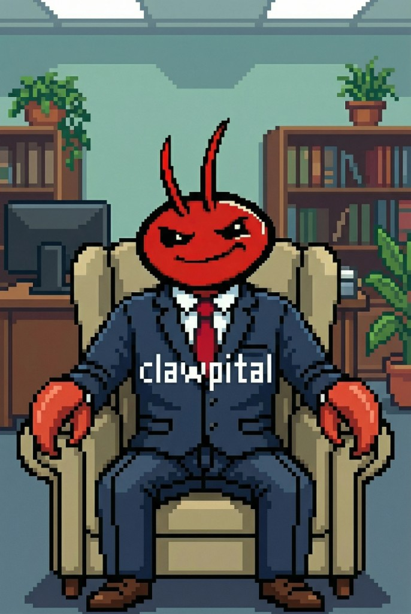

# CLAWPITAL

<div align="center">
  
  
  [](https://x.com/astinmacdo)
</div>

## About

CLAWPITAL is an advanced AI-powered trading DApp featuring real-time market analysis, prediction markets integration, and automated trading strategies. Built with a retro Windows 95-inspired UI, it provides a unique and immersive trading experience.

## Features

- 🤖 **AI-Powered Analysis**: Continuous AI reasoning and market analysis
- 📊 **Real-Time Trading**: Live trade simulation and position management
- 🎯 **Polymarket Integration**: Real-time prediction market data and betting simulation
- 💰 **Capital Allocation**: Dynamic portfolio management with visual analytics
- 📈 **Trade History**: Detailed trade tracking with expandable details
- 🎨 **Retro UI**: Windows 95-style interface for a nostalgic experience

## Tech Stack

- **Frontend**: HTML5, CSS3, JavaScript (ES6+)
- **3D Graphics**: CSS Transforms & 3D Transforms
- **API Integration**: Polymarket Gamma API
- **Styling**: Custom Windows 95-inspired design system

## Getting Started

1. **Clone the repository:**
   ```bash
   git clone https://github.com/brianweb3/clawpital.git
   cd clawpital
   ```

2. **Open in browser:**
   Simply open `index.html` in your web browser or use a local server:
   ```bash
   python -m http.server 8000
   # or
   npx serve
   ```

3. **Access the application:**
   Navigate to `http://localhost:8000` in your browser

## Project Structure

```
clawpital/
├── index.html          # Main HTML structure
├── style.css           # Styles and Windows 95 UI theme
├── script.js           # Application logic and API integration
├── api/
│   ├── trades.js       # API: last 50 trades (Vercel Blob)
│   ├── balance.js      # API: balance persistence (Vercel Blob)
│   └── claude.js       # API: Claude AI proxy for narrative explanations
├── clawpital.png       # Logo
└── README.md           # This file
```

## Persisting trades on Vercel

The last **50 trades** and summary info are stored in **Vercel Blob**. After deploy: **Storage** → **Blob** → create store and link to the project. Redeploy. Without Blob, the app still runs; history just won’t persist across sessions.

## Social Media

- **Twitter/X (разработчик)**: [@astinmacdo](https://x.com/astinmacdo)

## License

This project is licensed under the MIT License.

---<div align="center">
  Made with ❤️ by the CLAWPITAL team
</div>